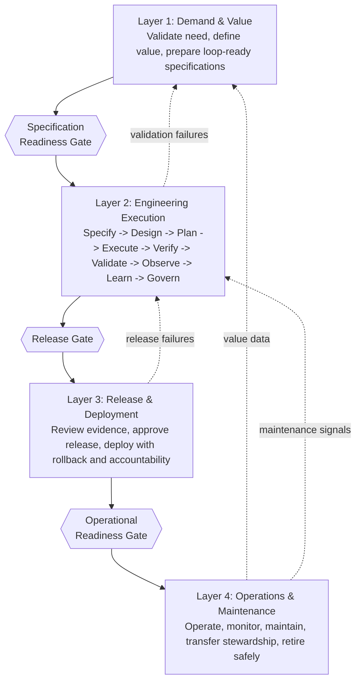

# Agentic Software Delivery Lifecycle (ASDLC)

_A governed lifecycle for organisations where autonomous agents participate as
first-class software delivery partners._

The Agentic Software Delivery Lifecycle is the full-lifecycle governance model
around agentic engineering. It answers a practical question that every serious
software organisation now has to face:

> What does it take to govern a delivery system where agents can write, test,
> change, and help deploy code?

The [Agentic Engineering Manifesto](../manifesto.md) defines the inner
engineering loop: how humans steer intent, agents execute within governed
boundaries, and teams verify outcomes with evidence. The ASDLC defines
everything around that loop: how demand is validated before execution, how
release decisions are governed before production, and how agent-built systems
are operated and maintained after deployment. Agents participate not only in
engineering execution (Layer 2) but as governance participants across all four
layers — advisory analysis, monitored execution, and human-gated recommendation
— within the epistemic tier framework defined in
[governance/agents.md](governance/agents.md).

It is not a replacement for your SDLC, DevOps practice, ITIL process, SAFe
operating model, or regulated development framework. It is the missing
governance layer for a new execution reality.

---

## Where to Start (Across the Stack)

The Agentic Engineering Manifesto, ASDLC, and APLC are a layered set, but each is independently adoptable. Pick the one that matches the pain you are feeling now — you do not need to adopt all three at once, and you do not need to read them in order.

| If your pain is… | Start with… |
| --- | --- |
| **An AI agent already in market or about to be**, and you cannot describe its behavior, prove its drift, or govern foundation-model updates that change it without warning | **[APLC](https://github.com/arnaudgelas/aplc)** — the Agentic Product Lifecycle. Governs the agent product itself: behavioral specification, evaluation, drift, foundation-model update governance, regulated retirement. |
| **Software delivery by teams using AI agents to write code**, where the inner loop runs faster than your demand validation, release governance, or operational readiness can keep up | **[ASDLC](https://github.com/arnaudgelas/asdlc)** — the Agentic Software Delivery Lifecycle. Governs the four-layer delivery lifecycle around agent-built software: demand, execution, release, operations. |
| **Engineering practice itself** — how humans steer intent, how agents execute within governed boundaries, what verified outcomes look like inside the inner loop | **[Manifesto](https://github.com/arnaudgelas/agentic-engineering-manifesto)** — the Agentic Engineering Manifesto. Defines the inner engineering loop that both APLC Stage 3 and ASDLC Layer 2 reference. |

Each framework is independently useful. Together they form a complete governance stack for organisations dealing with both agent-built software and agent products in market.

---

## Why This Exists

Agentic software delivery changes the shape of risk.

Traditional SDLC governance assumes that humans are the primary authors of code,
that review cycles happen at human speed, and that accountability can usually be
traced back to the people who made implementation decisions. Agentic delivery
breaks those assumptions. Agents can generate code quickly, compose dependencies
opportunistically, produce fluent explanations that sound more complete than
they are, and change systems faster than ordinary governance processes can
absorb.

That speed is valuable. But without a lifecycle around it, it creates
predictable failures:

- Teams build the wrong thing correctly because demand was never validated.
- Agents produce plausible work without sufficient evidence that it satisfies
  the specification.
- Loop-complete output is shipped before release accountability, rollback, or
  compliance records are ready.
- Production systems have no steward, no current runbook, and no reliable path
  back to the specification or evidence bundle.
- Incidents become archaeology because nobody can reconstruct what the system
  was meant to do, what it was verified against, or who accepted accountability.

The ASDLC is designed to prevent those failures without turning agentic delivery
into bureaucracy. Its core idea is simple: speed is useful only when the system
around it can keep intent, evidence, accountability, and operation in sync.

---

## The Model at a Glance

The ASDLC has four layers and three gates.

Each layer has a different job:

| Layer                             | Core question                                                                      | Primary accountability                               |
| --------------------------------- | ---------------------------------------------------------------------------------- | ---------------------------------------------------- |
| Layer 1: Demand & Value           | Is this the right thing to build, and do we know what success looks like?          | Product owner and business demand sponsor            |
| Layer 2: Engineering Execution    | Was this built correctly, against the specification, with complete evidence?       | Engineering lead and specification analyst           |
| Layer 3: Release & Deployment     | Should this be deployed now, with these authorisations, in this environment state? | Release manager, change authority, accountable human |
| Layer 4: Operations & Maintenance | Is the system being governed continuously in production?                           | System steward, SRE/on-call, accountable human       |

No layer is optional. Skipping Layer 1 produces well-executed work on the wrong
problem. Skipping Layer 3 ships ungoverned output. Skipping Layer 4 deploys
systems that no one truly owns.

---

## The Three Gates

The gates are the hard boundaries of the lifecycle. They are not ceremonial
approvals and they are not meetings. A gate is a structured assessment of
specific conditions. If any required condition is missing, the gate fails.

### 1. Specification Readiness Gate

**Boundary:** Layer 1 -> Layer 2  
**Purpose:** Prevent unvalidated or underspecified work from entering the
engineering loop.

A specification is ready for the loop only when the business need is validated,
the value is measurable, acceptance criteria can be expressed, constraints are
known, an accountable human is named, blast radius is assessed, and out-of-scope
work is explicit.

Start here: [specification-readiness.md](specification-readiness.md)

### 2. Release Gate

**Boundary:** Layer 2 -> Layer 3 **Purpose:** Prevent loop-complete output from
becoming production output before the evidence, approval, rollback, and
compliance conditions are satisfied.

A release is ready only when the evidence bundle is complete, independent
validation has passed where required, rollback has been tested, accountable
human sign-off is recorded, and compliance documentation is filed.

Start here: [release-governance.md](release-governance.md)

### 3. Operational Readiness Gate

**Boundary:** Layer 3 -> Layer 4 **Purpose:** Prevent deployed systems from
entering production operation without ownership, observability, runbooks,
stewardship, and traceability.

A system is operationally ready only when its runbook is complete, SLOs and
monitoring are configured, on-call is assigned and briefed, a system steward is
named, security and license checks are clean, and trace retention is configured.

Start here: [operations/dod.md](operations/dod.md)

---

## Entry Points

The ASDLC is a toolkit, not a sequential adoption mandate. Adopt it where your pain is most acute and expand from there. Four common entry points:

**Agents are producing plausible work, but you cannot verify it satisfies the specification** → **Release Gate**. Make evidence-bundle completeness, tested rollback, accountable human sign-off, and required validation blocking conditions before any production deployment. This is the largest single safety lever in the lifecycle. See [release-governance.md](release-governance.md).

**Specifications keep producing the wrong thing built correctly** → **Specification Readiness Gate**. Block specifications from entering the engineering loop unless they have validated need, measurable value, drafted acceptance criteria, identified constraints, a named accountable human, an assessed blast radius, and explicit out-of-scope work. See [specification-readiness.md](specification-readiness.md).

**Deployed systems have no owner, no current runbook, and no traceable specification** → **Operational Readiness Gate**. Require runbook complete, SLOs configured, on-call assigned and briefed, system steward named, security and license checks clean, and trace retention configured before production cutover. See [operations/dod.md](operations/dod.md).

**Demand keeps producing well-built but useless work** → **Layer 1 (Demand & Value)**. Build the demand backlog, validation tiers, prioritisation model, capacity model, and demand-to-specification bridge. The faster the inner loop runs, the more expensive it becomes to feed it poorly validated intent. See [demand/value.md](demand/value.md).

The ASDLC is not all-or-nothing. Each gate and layer has a minimum bar that can be implemented independently, before the others are mature.

---

## How to Read This Document Set

If you are new to ASDLC, read in this order:

1. [asdlc.md](asdlc.md) - the overview and conceptual model.
2. [../manifesto.md](../manifesto.md) - the engineering execution layer that
   sits inside ASDLC Layer 2.
3. [asdlc-guide.md](asdlc-guide.md) - the practical adoption sequence.
4. [specification-readiness.md](specification-readiness.md) - the first gate
   most teams should implement.
5. [release-governance.md](release-governance.md) - the production release
   boundary.
6. [operations/dod.md](operations/dod.md) - the minimum conditions for governed
   production operation.

If you already operate agentic engineering practices, start with the gates. Most
existing implementations have some version of the inner loop but weaker
boundaries before and after it.

If you work in a regulated environment, use the framework as an architecture for
evidence and accountability, then map it to your mandatory domain obligations.
ASDLC helps structure the lifecycle; it does not replace qualified regulatory,
legal, safety, or compliance judgement. For domain-specific Layer 1, 3, and 4
regulatory requirement mappings, see the [domains/](domains/) directory.

---

## Repository Map

### Core

- [asdlc.md](asdlc.md): The complete overview of the four-layer lifecycle,
  gates, feedback paths, values, adoption scenarios, and relationship to other
  frameworks.
- [asdlc-guide.md](asdlc-guide.md): The implementation guide, including the
  recommended adoption sequence, common failure modes, integration guidance, and
  phase-calibrated requirements.

### Layer 1: Demand & Value

- [demand/value.md](demand/value.md): How to validate business needs, define
  measurable value, govern the demand backlog, prioritise work, and translate
  demand into loop-ready specifications.
- [specification-readiness.md](specification-readiness.md): The nine-condition
  gate that determines whether a specification can enter the engineering loop.
- [demand/intelligence.md](demand/intelligence.md): Layer 0 pre-demand
  intelligence — governed agentic mechanisms for surfacing candidate demand from
  environmental signals before Layer 1 validation.
- [demand/metrics.md](demand/metrics.md): Metrics for value delivery,
  specification quality, demand health, and early warning signals.

### Layer 2: Engineering Execution

- [../manifesto.md](../manifesto.md): The Agentic Engineering Manifesto and
  inner loop.
- [../manifesto-principles.md](../manifesto-principles.md): The twelve
  principles that govern agentic engineering execution.
- [../manifesto-done.md](../manifesto-done.md): The engineering Definition of
  Done and hardening path.

Layer 2 is intentionally referenced from the main manifesto document set rather
than duplicated here. ASDLC surrounds it; the manifesto defines it.

### Layer 3: Release & Deployment

- [release-governance.md](release-governance.md): Release readiness criteria,
  approval chain, change management alignment, emergency change procedure, and
  regulatory release requirements.
- [deployment-governance.md](deployment-governance.md): Environment model,
  promotion gates, feature flag governance, rollback operationalisation, and
  deployment evidence.

### Layer 4: Operations & Maintenance

- [operations/governance.md](operations/governance.md): Operational
  observability, SLO/SLA governance, incident management, on-call practices, and
  production change management.
- [operations/dod.md](operations/dod.md): The operational Definition of Done and
  readiness conditions.
- [maintenance-governance.md](maintenance-governance.md): Stewardship transfer,
  security patching, technical debt lifecycle, license compliance, deprecation,
  and decommissioning.

### Cross-Cutting

- [governance/graph.md](governance/graph.md): Semantic governance graph — node
  types, edge types, GateState model, and continuous governance state
  inspection.
- [governance/agents.md](governance/agents.md): Governance agent framework,
  autonomy tier definitions, and epistemic tier labelling requirements.
- [agent-control-plane.md](agent-control-plane.md): Named governance agents,
  schemas, and human decision points.
- [waiver-governance.md](waiver-governance.md): Waiver lifecycle, expiry
  requirements, debt tracking, and portfolio-level waiver oversight.
- [governance/queries.md](governance/queries.md): Canonical governance questions
  and their authoritative data sources.
- [finops-governance.md](finops-governance.md): FinOps and inference cost
  governance, aligned to the FinOps Foundation maturity model.
- [security-governance.md](security-governance.md): Security lifecycle
  governance and NIST SSDF mapping.
- [devsecops-controls.md](devsecops-controls.md): DevSecOps pipeline control
  matrix by autonomy tier.

### Domain Guidance

Layer 1, 3, and 4 regulatory requirements mapped to specific regulated
industries. Each document covers demand-layer obligations, release gate
regulatory conditions, and operational compliance requirements for that domain.

- [domains/aviation.md](domains/aviation.md): DO-178C, ARP 4754A, DO-326A,
  EASA/FAA Part 21, ICAO — airborne software and CNS/ATM systems.
- [domains/financial-services.md](domains/financial-services.md): SR 11-7, DORA,
  EU AI Act, SOX, FCA PS21/3 — banking, capital markets, insurance.
- [domains/pharma.md](domains/pharma.md): GAMP 5, 21 CFR Part 11, EU Annex 11,
  GxP validation — pharmaceuticals and life sciences.
- [domains/automotive.md](domains/automotive.md): ISO 26262, ASPICE, UN
  Regulation 157, SUMS — road vehicles and autonomous driving.
- [domains/insurance.md](domains/insurance.md): Solvency II, EU AI Act, DORA,
  FCA Consumer Duty — insurance carriers and intermediaries.
- [domains/defense-government.md](domains/defense-government.md): CMMC, FedRAMP,
  NIST SP 800-53, ATO process, ITAR/EAR — defense and government contracting.

For manifesto-principle-to-regulatory mappings (autonomy tier tables, SOUP
treatment, hard autonomy caps), see the corresponding files in
[../domains/](../domains/).

---

## Adoption Path

ASDLC adoption should be incremental. Trying to install all four layers at once
usually creates process theatre: documents exist, but teams cannot operate them.

The recommended path is:

1. **Establish inner-loop governance.** Operate the manifesto loop at Phase 3
   minimum in at least one domain, with evidence bundles and named human
   accountability.
2. **Add the Specification Readiness Gate.** Block specifications that do not
   have validated need, measurable value, explicit constraints, and a named
   accountable human.
3. **Add the Release Gate.** Make evidence bundle completeness, tested rollback,
   accountable sign-off, and required validation blocking conditions for
   production deployment.
4. **Add the Demand Layer.** Build the demand backlog, validation tiers,
   prioritisation model, capacity model, and demand-to-specification bridge.
5. **Add the Operational Readiness Gate and runbooks.** Ensure production
   systems have SLOs, on-call briefing, stewardship, trace retention, security
   checks, and operational documentation.
6. **Add full maintenance governance.** Govern ownership transfer, dependency
   updates, security patching, license compliance, technical debt, deprecation,
   and retirement.

The key discipline is sequencing. The outer layers depend on the inner loop
producing evidence. The release gate depends on an evidence bundle. The
operational layer depends on a deployed system with a known specification, known
evidence, and known accountable humans.

See [asdlc-guide.md](asdlc-guide.md) for the full implementation guidance.

---

## What Makes ASDLC Different

ASDLC is not just "SDLC with AI added." It introduces governance structures for
risks that conventional software lifecycle models were not designed to address:

- **Agentic output requires evidence, not confidence.** A fluent explanation is
  not proof. ASDLC treats verification artefacts, traceability, and gate records
  as the durable record.
- **Accountability must be explicit.** The agent cannot be the accountable
  party. A named human must accept accountability at the relevant boundary.
  Agents may prepare evidence, summarise risk, and recommend decisions; they may
  not accept residual risk, approve production exposure, or absorb
  accountability for outcomes.
- **Demand quality matters more when execution accelerates.** The faster the
  loop runs, the more expensive it becomes to feed it poorly validated intent.
- **Rollback must be tested, not merely documented.** Production safety depends
  on practiced reversibility.
- **Operations must know the specification.** For agent-generated systems, the
  runbook must link back to the specification and evidence bundle because there
  may be no human code author to ask.
- **Governance must be observable.** Stale evidence, missing owners, expired
  waivers, and rubber-stamping patterns are governance failures as consequential
  as production outages. The governance graph provides the queryable state that
  makes continuous governance possible.
- **Maintenance is part of governance.** Dependency drift, model changes,
  stewardship transfer, trace retention, and retirement are lifecycle concerns,
  not afterthoughts.

The framework is intentionally sober about agentic capability. It assumes agents
are powerful enough to be useful and fallible enough to require governance.

---

## Values

The ASDLC inherits the manifesto's engineering values for Layer 2. Across the
full lifecycle, it adds three more:

| We value more                           | over | We also value                           |
| --------------------------------------- | ---- | --------------------------------------- |
| Validated demand before execution       | over | Starting the loop on unvalidated intent |
| Governed release over shipped artefacts | over | Deployment without accountability       |
| Operated outcomes over deployed systems | over | Declaring done at deployment            |

These are not slogans. They map directly to the three gates:

- Validated demand becomes the Specification Readiness Gate.
- Governed release becomes the Release Gate.
- Operated outcomes become the Operational Readiness Gate.

---

## Common Failure Modes This Framework Prevents

### Building the wrong thing correctly

The engineering loop verifies that the output satisfies the specification. It
cannot rescue a specification that never represented the business need. Layer 1
and the Specification Readiness Gate prevent this by requiring validation
evidence, measurable value, and domain-recognisable acceptance criteria before
execution begins.

### Shipping assertions instead of evidence

Agentic systems can produce convincing summaries of what they did. The release
gate requires evidence: evaluation results, trace records, validation outcomes,
rollback tests, sign-offs, and compliance artefacts.

### Treating deployment as done

Deployment is not the end of the lifecycle. It is the beginning of production
accountability. Layer 4 requires runbooks, SLOs, monitoring, on-call briefing,
stewardship, trace retention, security scanning, maintenance, and eventual
retirement.

### Losing accountability in production

When the system fails, "the agent wrote it" is not an escalation path. ASDLC
requires a named accountable human and a system steward so production decisions
have a human owner.

---

## Relationship to Existing Frameworks

ASDLC is designed to coexist with established operating models:

- **SAFe:** Layer 1 maps to portfolio and program demand governance; Layer 2 to
  team execution; Layer 3 to release train governance; Layer 4 to operational
  value streams.
- **ITIL:** Layer 3 extends change management with agentic evidence bundles and
  tested rollback; Layer 4 extends service operation with output quality, trace
  completeness, and agent-specific incident handling.
- **DevOps and DORA:** The gates provide mechanisms that affect deployment
  frequency, lead time, change failure rate, and mean time to restore.
- **Regulated SDLC frameworks:** ASDLC structures agentic execution within
  frameworks such as IEC 62304, GAMP 5, DO-178C, SR 11-7, and comparable
  regimes. It is a lifecycle architecture, not a compliance determination.

See [asdlc.md](asdlc.md) and [asdlc-guide.md](asdlc-guide.md) for detailed
mappings.

---

## A Practical Starting Point

If you only do one thing first, implement the Specification Readiness Gate.

It is the smallest intervention with the largest leverage. Before any agentic
loop iteration starts, require a short record showing:

- the need is validated with examinable evidence;
- the value is measurable and time-bounded;
- acceptance criteria can be drafted by a domain expert;
- constraints are identified;
- an accountable human is named;
- blast radius is assessed;
- out-of-scope work is explicit;
- loop cost is justified against expected value;
- the context thread is assembled and reviewed.

This immediately changes the quality of work entering the loop. It also teaches
the organisation where its current demand process is weak, which makes the rest
of ASDLC adoption concrete rather than abstract.

---

## Tone and Intent

ASDLC is deliberately rigorous, but its purpose is humane: to make high-speed
software delivery safer, clearer, and more accountable for the people who depend
on it.

It gives product owners a way to say "not ready yet" with evidence rather than
politics. It gives engineers a clearer contract for what the loop is meant to
build. It gives release managers a concrete basis for saying whether a
deployment is ready. It gives operators a runbook connected to the real intent
and evidence behind the system. And it gives accountable humans a lifecycle they
can stand behind.

The goal is not to slow teams down. The goal is to make sure speed compounds
into trustworthy outcomes instead of unmanaged risk.

---

## Evidence Base

The ASDLC is normative — it states what governed agentic delivery requires —
but its core claims are anchored against three external reference bodies. None
of these sources prescribe the four-layer ASDLC architecture; together they
support the load-bearing assumptions on which the architecture rests.

**Lifecycle and AI-management standards.** ISO/IEC 5338:2023 (AI system life
cycle processes) and ISO/IEC 42001:2023 (AI management systems) define the
process-level and management-system requirements that a governance lifecycle
for AI must address. The NIST AI Risk Management Framework 1.0 (NIST AI 100-1,
2023) and its Generative AI Profile (NIST AI 600-1, 2024) provide the
risk-management vocabulary — Govern, Map, Measure, Manage — that the ASDLC
operationalises across its four layers. ISO/IEC 23894:2023 supplies the
companion AI risk management guidance.

**Agentic and AI security guidance.** NIST SP 800-218A (Secure Software
Development Practices for Generative AI and Dual-Use Foundation Models, 2024)
extends the SSDF for AI development. NIST AI 100-2e2025 (Adversarial Machine
Learning: A Taxonomy and Terminology of Attacks and Mitigations, 2025) provides
the formal attack taxonomy used in threat modeling. OWASP's *Agentic AI —
Threats and Mitigations* (2025) covers tool misuse, goal hijacking, identity
and privilege abuse, and memory poisoning specific to agentic systems, and the
OWASP Top 10 for LLM Applications (2025) supplies the broader application
security baseline. CISA et al., *Shifting the Balance of Cybersecurity Risk:
Principles and Approaches for Secure by Design Software* (2023), is the
operational framing for security as lifecycle ownership rather than a final
gate.

**Empirical software-agent evidence.** CMU SEI's *AI Engineering: 12
Foundational Practices* (2026) and the DORA *Accelerate State of DevOps Report
2024* establish the engineering-discipline and delivery-performance baselines
the ASDLC inherits. Empirical work on AI-assisted coding informs the
framework's anti-rubber-stamp posture: Peng et al. (2023) measured material
acceleration on bounded coding tasks; Becker et al. (METR, 2025) showed that
experienced developers believed AI sped them up while measured completion time
increased on realistic maintenance tasks; Pearce et al. (IEEE S&P 2022) and
Perry et al. (ACM CCS 2023) documented insecure-code generation and
overconfidence in AI-assisted output. SWE-bench (Jimenez et al., ICLR 2024),
SWE-agent (Yang et al., 2024), and SWE-CI (Chen et al., 2026) are the
benchmark references for software-agent capability and long-horizon
maintenance behaviour. The UK DSIT *Portfolio of AI assurance techniques*
(2023) catalogues the assurance techniques that operationalise the gate
evidence model.

These sources do not prove that a four-layer ASDLC is the only correct
lifecycle, that any current agent can be trusted for Tier 4 autonomy, or that
a passing security scan is sufficient. They support layered controls,
traceability, human accountability, and continuous monitoring — the postures
the ASDLC encodes.

Full citations and authoritative links are filed in the normative references
of each domain document (`security-governance.md`, `devsecops-controls.md`,
`governance/agents.md`, `asdlc.md`).

---

## License and Contribution

This ASDLC document set is part of the broader
[Agentic Engineering Manifesto](../README.md) repository. See the
repository-level license and contribution guidance for terms, authorship, and
how to propose changes.
