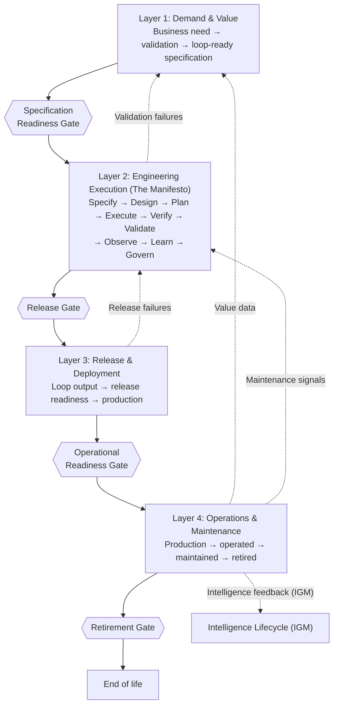

# Agentic Software Delivery Lifecycle — Overview

_The complete governed software delivery lifecycle for organisations where
autonomous agents participate as first-class execution partners._

See the [Manifesto](../manifesto.md) for the engineering execution layer (Layer
2). See [Implementation Guide](asdlc-guide.md) for how to build ASDLC governance
incrementally.

---

## What is the ASDLC?

The Agentic Software Delivery Lifecycle is the complete governed software
delivery lifecycle for organisations where autonomous agents participate as
first-class execution partners. It is not a replacement for existing SDLC
practices — it is a governed extension of them, designed for the specific
reality that agents can now write, test, and deploy code autonomously, and that
this capability creates governance obligations that no prior software lifecycle
framework anticipated. The Agentic Engineering Manifesto governs Layer 2: the
engineering execution loop. The ASDLC provides the chassis around it: the demand
layer upstream, the release layer downstream, and the operational layer for the
long run. Together, the four layers govern a delivery system from business
intent through production outcome. No layer is optional. Skipping the demand
layer produces well-executed work on the wrong problem. Skipping the release
layer ships unverified output to production. Skipping the operational layer
deploys systems that no one owns.

---

## The Four-Layer Model

> **Note — autonomy tier 1–3 flow.** The flowchart above represents the
> standard gate-per-change flow applicable to autonomy tier 1, 2, and 3
> systems. For autonomy tier 4 systems, the gate model is modified as described
> in the Tier 4 paragraphs in each Layer section below: the Release Gate
> applies to the policy envelope
> specification rather than individual deployments, the inner loop executes
> without per-change human approval, and Layer 4 accountability is
> envelope-level rather than action-level. The layer sequence and feedback paths
> remain the same; the granularity and object of each gate changes.

### Layer 1: Demand & Value

Layer 1 is the governed demand layer. It exists for one reason: ensuring that
only validated, prioritised, loop-ready specifications enter the engineering
execution loop. The demand layer does not execute — it governs what gets
executed and in what order. Its primary question is: _Is this the right thing to
build, and do we know what success looks like?_ Primary stakeholder: the product
owner and business demand sponsor. Timescale: weeks to months — validation and
prioritisation happen at the portfolio cadence, not the sprint cadence. A team
that skips this layer will build the wrong things correctly, consistently, at
increasing speed. See [Demand & Value](demand/value.md).

The demand layer governs validation. A continuously running demand intelligence
function (see [demand/intelligence.md](demand/intelligence.md)) provides the
agentic mechanism for surfacing candidate demand items from environmental
signals — regulatory updates, operational anomalies, competitive signals, and
internal feedback — before they reach Layer 1. The product owner's validation
judgment at Layer 1 remains the entry point for all engineering investment; the
demand intelligence function ensures that judgment is applied to a continuously
updated, signal-derived candidate set rather than only to items that humans
happen to notice and manually enter.

### Layer 2: Engineering Execution

Layer 2 is the Agentic Engineering Manifesto's inner loop: Specify → Design →
Plan → Execute → Verify → Validate → Observe → Learn → Govern. It accepts
loop-ready specifications from Layer 1 and produces evidence-backed deployables
for Layer 3. The primary question is: _Was this built correctly, does it do what
the specification required, and is the evidence complete?_ Primary stakeholder:
engineering leads and specification analysts. Timescale: days to weeks per loop
iteration. This layer has its own governance structures, autonomy tiers, and
Definition of Done — all defined in the [Manifesto](../manifesto.md). The outer
layers govern what enters and leaves it; the manifesto governs what happens
inside it.

**Tier 4 operation in Layer 2.** For autonomy tier 4 systems, the
inner loop runs without per-change human approval. Agents execute within a
human-approved, machine-enforced policy envelope; individual actions within that
envelope do not require a separate human gate. The governance obligation does
not disappear — it shifts. Evidence is produced at the policy envelope boundary,
not per-action: the envelope definition, the constraint set, the evaluation
portfolio that validated the envelope, and the continuous monitoring telemetry
collectively constitute the governance record. A Tier 4 inner loop that produces
no boundary-level evidence is not operating at Tier 4 with reduced overhead — it
is ungoverned. The Govern phase at Layer 2 for Tier 4 systems therefore focuses
on envelope health: confirming that agent actions remain within the approved
envelope, flagging boundary violations for immediate human review, and
triggering a re-gate cycle if the effective operating envelope has drifted from
the approved specification.

### Layer 3: Release & Deployment

Layer 3 begins where the engineering loop ends. A loop-complete output — one
that has satisfied all seven Definition of Done conditions — is not yet
production-ready. The release layer governs the journey from loop-complete to
production-deployed: verifying the evidence bundle, applying the release
approval chain, executing the deployment, and formally initiating the handoff to
operations. The primary question is: _Should this be deployed, now, with these
authorisations, in this environment state?_ Primary stakeholder: release
managers, change management, and compliance officers in regulated environments.
Timescale: hours to days — the release window governs the pace, not the loop.
See [Release & Deployment Governance](release-governance.md).

**Tier 4 operation in Layer 3.** For autonomy tier 4 systems, the Release Gate
applies to the policy envelope specification, not to individual deployments
within an approved envelope. The gate conditions are the same — evidence bundle
complete, independent validation passed, rollback procedure tested, accountable
human sign-off, compliance documentation complete — but the object of the gate
is the envelope definition: its constraint set, its authorised action scope,
its monitoring configuration, and the evaluation portfolio that validated the
envelope's safety properties. Once the envelope is gate-approved, subsequent
agent-executed deployments that remain within the envelope do not require a
separate release gate pass. Any deployment that would extend, modify, or
operate outside the approved envelope is subject to the full release gate on
the proposed envelope change. The transition from autonomy tier 3 to autonomy
tier 4 operation for a system is itself a governed event: the decision to
authorise autonomous operation within a policy envelope must pass the Release
Gate on the initial envelope definition before Tier 4 operation begins. This gate pass is the formal
record that the organisation has accepted the envelope as sufficient governance
for the system's blast radius.

**Framework-agnostic autonomy tier 4 envelope.** Regardless of whether an
organisation operates the Agentic Enterprise Manifesto (AEnt-M) or the
Intelligence Governance Manifesto (IGM), every autonomy tier 4 envelope must
satisfy the following minimal obligations: (a) the policy envelope is itself a
gate-approved artefact, passed through the Release Gate as the object of the
gate before autonomy tier 4 operation begins; (b) continuous monitoring
telemetry confirms that agent actions remain within the envelope and surfaces
boundary violations for immediate human review; (c) a named envelope steward
initiates a re-gate cycle when the operating environment evolves materially
enough to invalidate the envelope's safety assumptions; (d) per-action
accountability collapses to envelope-level accountability anchored at a named
human who has accepted production accountability for the envelope's design;
and (e) evidence is produced at envelope boundaries — envelope definition,
constraint set, evaluation portfolio, monitoring telemetry — not per
individual agent action. These obligations apply to every autonomy tier 4
envelope and are sufficient to govern autonomy tier 4 operation in the absence
of AEnt-M or IGM.

**Pointer — relocation mechanics under AEnt-M.** When an organisation operates
AEnt-M alongside the ASDLC, the autonomy tier 4 envelope additionally carries
relocation mechanics — multi-class envelope composition, per-class P7 metric
monitoring, automatic reversion to synchronous checking, and re-relocation
evidence. These mechanics have been moved to
[annex-aentm.md](annex-aentm.md), so that the core ASDLC remains independently
adoptable for organisations not operating AEnt-M. The framework-agnostic
envelope obligations above remain in `asdlc.md`; AEnt-M-specific relocation
mechanics live in the annex.

### Layer 4: Operations & Maintenance

Layer 4 begins at production deployment and runs for the rest of the system's
life. It covers the full operational arc: running the system reliably, detecting
and responding to incidents, maintaining it as the environment changes, and
retiring it in a controlled and documented manner. For agentic systems, this
layer carries specific challenges that traditional service operations does not
face: the code was generated by an agent, not hand-authored; reasoning traces
may not be production-accessible; and the escalation path "to the developer who
wrote this" has no valid target. The primary question is: _Is the system being
governed continuously in production?_ Primary stakeholder: SREs, system
stewards, and the named accountable human. Timescale: months to years — the
lifetime of the system. See [Operations & Governance](operations/governance.md).

**Tier 4 operation in Layer 4.** For autonomy tier 4 systems, the system
steward's accountability model shifts from per-change approval to envelope
stewardship.
The steward is not accountable for approving each agent action — those occur
within the pre-approved envelope. The steward is accountable for: (a) confirming
that the envelope remains correctly specified as the operating environment
evolves; (b) monitoring that the system's actual behaviour remains within the
approved envelope parameters; (c) initiating a re-gate cycle when the
environment has changed materially enough to invalidate the envelope's safety
assumptions; and (d) accepting production accountability for the envelope design
and for any gap between the envelope's intended constraints and its operational
effect. An incident in a Tier 4 system that traces to an action within the
approved envelope is an envelope design failure, not an operational failure —
the steward is accountable for the envelope's adequacy, and the post-incident
review must assess whether the envelope should have been defined more
restrictively. An incident that traces to an action outside the approved
envelope is a control failure — the machine enforcement layer failed, and the
post-incident review must assess the enforcement mechanism's adequacy, not just
the incident itself.

**Pointer — intelligence constraints under IGM.** When an organisation
operates the Intelligence Governance Manifesto (IGM) alongside the ASDLC, an
autonomy tier 4 envelope for an intelligence-bearing system additionally
carries intelligence constraints — epistemic-tier-to-action mapping, typed
contradiction-handling rules, per-claim-class decay boundaries, and
feedback-loop closure rules. These constraints have been moved to
[annex-igm.md](annex-igm.md), so that the core ASDLC remains independently
adoptable for organisations not operating IGM. The framework-agnostic
envelope obligations stated above remain in `asdlc.md`; IGM-specific
intelligence constraints live in the annex.

---

## Layer Interface Contracts

Each layer boundary is governed by a gate. The ASDLC defines four gates: the
Specification Readiness Gate at L1 → L2, the Release Gate at L2 → L3, the
Operational Readiness Gate at L3 → L4, and the Retirement Gate at L4 →
end-of-life. Gates are not committee approvals. They are structured assessments
of specific conditions — each condition binary, each condition necessary. A
partial pass is a fail. A gate that was "run" but produced no record was not
run.

---

### Specification Readiness Gate (L1 → L2)

**Boundary:** Separates governed demand from engineering execution.

**Pass conditions:**

The Specification Readiness Gate has 9 conditions. The canonical enumeration —
condition titles, identifiers, and pass criteria — is maintained in
[governance/gate-registry.md](governance/gate-registry.md), which is the
authoritative source. A specification that satisfies all 9 conditions satisfies
the manifesto's loop-readiness requirement and may enter Layer 2. This document
does not restate the condition list inline, to prevent drift between the
overview and the registry.

**Failure mode if bypassed:** The loop executes correctly against an incorrectly
understood need. Verify passes. Validate fails. The organisation has produced a
technically sound implementation of the wrong problem, at full loop cost, with
the root cause untraceable because no one recorded what they were building or
why. See [Specification Readiness](specification-readiness.md).

---

### Release Gate (L2 → L3)

**Boundary:** Separates engineering execution from production deployment.

**Pass conditions:**

The Release Gate has 8 conditions. The canonical enumeration — condition
titles, identifiers, applicability rules (including the adoption-phase rule for
independent validation), and pass criteria — is maintained in
[governance/gate-registry.md](governance/gate-registry.md), which is the
authoritative source. The detailed prose is in
[Release & Deployment Governance](release-governance.md). This document does
not restate the condition list inline, to prevent drift between the overview
and the registry.

**Failure mode if bypassed:** Unverified or ungoverned output reaches
production. When a production incident occurs, there is no reliable record of
what the system was supposed to do, what it was verified against, or who
reviewed the evidence. Incident investigation becomes archaeology. In regulated
environments, the deployment itself may be a compliance violation. See
[Release & Deployment Governance](release-governance.md).

---

### Operational Readiness Gate (L3 → L4)

**Boundary:** Separates deployment from governed production operation.

**Pass conditions:**

The Operational Definition of Done has 8 conditions in total: 7 unconditional
and 1 conditional (DR/failover, applicable to blast-radius tier 3 systems
only). The canonical enumeration — condition titles, identifiers, applicability
rules, and pass criteria — is maintained in
[governance/gate-registry.md](governance/gate-registry.md), which is the
authoritative source. The detailed prose is in
[Operational Definition of Done](operations/dod.md). This document does not
restate the condition list inline, to prevent drift between the overview and
the registry.

**Failure mode if bypassed:** Ungoverned systems in production. The runbook does
not exist or is stale. The steward is unnamed. Security vulnerabilities
accumulate without detection. When an incident occurs, the on-call engineer has
no escalation path, no rollback procedure, and no record of what the system was
built to do. See [Operational Definition of Done](operations/dod.md).

---

### Retirement Gate (L4 → end-of-life)

**Boundary:** Separates governed production operation from controlled,
documented end-of-life. A system that exits production without passing this
gate has not been retired; it has been abandoned.

**Pass conditions:**

The Retirement Gate has 8 conditions. The canonical enumeration — condition
titles, identifiers, applicability rules (including the IGM-conditional
condition for systems whose claims have informed governed intelligence), and
pass criteria — is maintained in
[governance/gate-registry.md](governance/gate-registry.md), which is the
authoritative source. The detailed prose is in
[Retirement Gate](retirement-gate.md). This document does not restate the
condition list inline, to prevent drift between the overview and the registry.

**Failure mode if bypassed:** Orphaned systems with open obligations. Records
that were due for archival or destruction remain in undefined state.
Accountability transfers were never made: the named human on the runbook has
left the organisation, the system steward has rotated off, and no successor
has accepted the residual obligations. Dependency notifications were never
sent: downstream systems still call endpoints that no longer exist.
Retention-rights violations accrue silently as personal data outlives its
lawful retention basis. For systems that have informed governed intelligence,
retired claims continue to inform live decisions in the Intelligence
Governance Manifesto's substrate, because no supersession or invalidation
record was filed at the retirement boundary. See
[Retirement Gate](retirement-gate.md).

---

## Feedback Paths

The ASDLC is not a waterfall. Evidence flows back from every downstream layer,
and each feedback signal must produce a specific upstream action — not
acknowledgement, not a retrospective note, but a change to a process.

**L4 → L1: Value data to demand.** Production incidents and value realisation
data feed back into demand prioritisation. If deployed systems consistently fail
to achieve their business success criterion, the demand layer's validation
process is producing false positives. A value realisation rate below 60% over
any rolling four-release window is a demand health emergency: the needs are
either not as real as the evidence suggested, or the success criteria were set
wrong, or the measurement infrastructure does not exist. All three are Layer 1
failures. This feedback path is the outer loop's primary quality signal on
whether the demand layer is working. A value realisation shortfall triggering
this path must produce a demand layer retrospective initiated within 30 calendar
days of the value measurement window closing. The retrospective must produce a
documented process change — not an acknowledgement — within 20 business days of
its initiation, and a corresponding evaluation/validation update — to the
demand-validation criterion or the demand-evidence schema — that encodes the
failure class so that future demand items of this type are detected before the
loop runs. Closure is recorded only when the evaluation update is filed and
the next equivalent demand passes through the updated criterion. If the
retrospective cannot be scheduled within the 30-day window, the business
demand sponsor for the affected initiative is accountable for explaining the
delay.

**L4 → L2: Maintenance signals to engineering.** Maintenance burden and
structural regression signals — high rates of post-deployment defects,
accumulating technical debt in agent-generated code, recurring patterns of
dependency fragility — feed back into the engineering loop's Learn and Govern
phases. The goal is not just to fix individual defects but to update the
evaluation portfolio, the memory, and the design constraints so that the class
of failure is caught before the next loop iteration completes. A maintenance
signal that produces only a hotfix, without an evaluation update, has not closed
— it has been deferred. A maintenance signal requiring a specification or
evaluation update must result in a filed specification or evaluation change
within 30 calendar days of the signal being identified. A maintenance signal
that produces only a hotfix without an evaluation update has not been closed at
30 days — the evaluation update is the closing condition, not the hotfix.

**L3 → L2: Release failures to engineering.** Release gate failures — loop
outputs that fail release gate conditions — feed back into the Govern phase of
the engineering loop. A pattern of release failures that traces to constraint
discovery post-gate is a signal that the demand layer's constraint
identification is insufficiently thorough. A pattern of rollback procedure
failures at test time is a signal that the Govern phase is not treating rollback
testing as a first-class engineering concern. Release failures are not release
layer problems — they are engineering loop problems surfaced at the release
boundary. A pattern of release gate failures (two or more failures tracing to
the same root cause within a rolling 60-day window) must produce a loop-level
process change in progress within 10 business days of the pattern being
identified, and a corresponding evaluation-suite update encoding the failure
class, plus a re-run of the affected evaluation cases under the updated suite.
The loop-level process change is not closed until the evaluation update has
been filed and demonstrably passes. A single release failure does not trigger
this SLO; the pattern does.

**L2 → L1: Validation failures to demand.** When the loop builds the wrong thing
correctly — verification passes, validation fails — the proximate cause is
almost always in the demand layer. Either the specification did not preserve
business intent faithfully (a translation failure), or the business need was not
as well-understood as the validation evidence suggested (a validation quality
failure). A pattern of validation failures, or any single validation failure
that reaches a customer-facing system, requires a demand layer retrospective.
The retrospective must produce a specific process change — not an
acknowledgement that "we need to be more careful." A validation failure that
produces a demand-signal classification (the specification did not represent the
actual need) must produce a demand layer retrospective initiated within 5
business days and a documented process change within 20 business days, and a
corresponding update to the demand-validation criterion, plus a re-run of the
validation evidence in the demand layer's accumulated artefacts — closure is
recorded only when the updated criterion is in force and the next equivalent
demand item passes through it. A validation failure at a customer-facing
system triggers the 5-business-day SLO regardless of the rolling pattern.

**L4 → Intelligence Lifecycle: Production incidents and maintenance signals.**
For systems whose actions are informed by intelligence — domain-graph claims,
provenance-tracked assertions, or other governed knowledge substrate covered by
the Intelligence Governance Manifesto (IGM) — production incidents and steward
review findings feed back not only to the engineering execution layer but to
the intelligence lifecycle itself. When an L4 incident or steward review
identifies that a production failure was informed by intelligence, the
investigation must explicitly include: (i) which claims informed the failed
action, identified by claim identifier and epistemic tier at the time of
action; (ii) whether those claims were stale, contradicted, misapplied, or
correctly reflecting reality but invoked outside their applicable scope; (iii)
structured feedback to the IGM revision, assertion, and semantic authorities
responsible for the affected claims and their relationships; and (iv) a
timeline for claim re-verification not exceeding 30 calendar days from
incident closure. A steward who closes an incident without producing the
intelligence-feedback record has not closed the incident — the closure is
provisional pending the IGM-side feedback artefact. This feedback path is the
operational expression of IGM Principle 10 (*Every engagement feeds the domain
graph*) at the L4 boundary: production is itself an engagement on the
substrate, and incidents are the highest-signal observations that engagement
produces.

All four feedback paths share the same closure schema: a process-change
record, a corresponding evaluation/validation/demand-criterion update, and a
re-run that demonstrates the change is effective. A path that produces only a
process-change record without the evaluation update has not closed.

The SLOs documented for each feedback path above govern human-driven feedback
processes. Where governance agents are configured to continuously monitor
feedback signals, an additional immediate-tier signal — an agent-detected
anomaly surfaced in real time — supplements the scheduled SLO-governed
retrospective. This supplement does not replace the retrospective. The
retrospective exists to produce a documented process change; the governance
agent's continuous monitoring exists to surface anomalies early enough to
prevent them from compounding. Teams may configure governance agent monitoring
for immediate-tier signaling on any of the four feedback paths. Doing so does
not modify the SLO-governed retrospective requirement: the retrospective remains
mandatory regardless of whether the governance agent detected the signal before
or after the SLO window opened.

For organisations where executing agents are governed under the ASDLC, feedback
paths must also produce agent behavior changes through the learning closure
mechanism: evaluation suite updates that encode the failure class in a
machine-verifiable form, prompt updates that reflect new behavioral guidance,
and contributions to the organisation's governed training corpus where the
learning is fundamental enough to warrant it. A feedback path that produces a
documented process change without a corresponding evaluation suite update has
documented the learning without closing it. A process change record and an
evaluation suite update are both required for a feedback path to be considered
closed. See [maintenance-governance.md](maintenance-governance.md) for the
learning closure mechanism specification.

When an incident in one system reveals a failure class, the learning must
propagate laterally to analogous systems through a governed cross-system
learning process — not only to the system that experienced the incident. The
governance graph's system topology makes analogous systems identifiable: systems
that share constraint classes, evaluation portfolio patterns, or deployment
environment characteristics are candidates for lateral propagation. Steward
review determines whether propagation is appropriate for each candidate system;
propagation is not automatic. A failure class identified in one system and not
assessed for lateral applicability is a governance gap in all analogous systems
until the assessment is made and recorded.

---

## ASDLC Values

The manifesto's six inner-loop values are inherited in full for Layer 2. The
ASDLC adds three full-lifecycle values:

| We Value More                           | over | We Also Value                           |
| --------------------------------------- | ---- | --------------------------------------- |
| Validated demand before execution       | over | Starting the loop on unvalidated intent |
| Governed release over shipped artefacts | over | Deployment without accountability       |
| Operated outcomes over deployed systems | over | Declaring done at deployment            |

These values translate directly into the gate structures above. Validated demand
before execution is the Specification Readiness Gate. Governed release over
shipped artefacts is the Release Gate. Operated outcomes over deployed systems
is the Operational Readiness Gate. The values name the failure modes the gates
prevent.

### Governance of Governance

The ASDLC's governance infrastructure — the control evaluation systems, the
governance graph, the gate tooling, the waiver management system, and the
governance agents that perform advisory and monitoring tasks — must itself be
governed. This is not a theoretical concern: a gate tool that silently degrades
produces gate passes that are not passes; a waiver management system that loses
records produces a compliance posture that does not reflect reality; a
governance graph that falls out of synchronisation with the delivery state
produces governance queries whose answers cannot be trusted. The governance
infrastructure is not exempt from the lifecycle obligations it enforces on other
systems.

Changes to any element of the ASDLC governance infrastructure follow the same
lifecycle as governed production systems: specification of the change, evidence
of testing, release gate evaluation, and named accountable human sign-off.
Governance infrastructure does not have a fast path for "minor" updates — a
change that appears minor (a threshold adjustment, a query modification, a new
waiver category) may have downstream effects on gate pass rates, audit trails,
or compliance posture that are not visible at the point of the change. The
evaluation portfolio for governance infrastructure must cover
governance-correctness: does the tool continue to enforce the gate conditions it
is specified to enforce, under the range of inputs it will encounter in
production?

The steward of the governance infrastructure is distinct from the stewards of
the systems it governs. The governance steward accepts accountability for the
infrastructure's correctness, currency, and operational health, and initiates
re-verification when any component of the infrastructure is modified. A
governance infrastructure that has not been re-verified following a material
change is not a governed system enforcing governance — it is an unverified claim
that governance is operating.

**Termination of recursion.** The recursion of governing the governance
terminates at a named accountable executive who accepts residual risk on the
governance infrastructure on behalf of the organisation. This executive is
identified by name and role in the governance portfolio register. The
acceptance is renewed at the cadence defined by the operational Definition of
Done review (default: quarterly) and is filed as an EvidenceArtifact in the
governance graph with an approved_by edge to the executive's HumanOwner node.
A governance infrastructure with no named executive holding residual-risk
acceptance, or with an expired acceptance, is itself in stale GateState — the
recursion cannot be silently open. The accountable executive may delegate
operational stewardship of the governance infrastructure but may not delegate
the residual-risk acceptance.

---

## How to Adopt

### Starting from nothing

Begin at Layer 1. Establish a minimal demand governance practice: validate needs
with evidence before engineering begins, define a measurable success criterion
for each initiative, and name an accountable human before the loop runs. Then
build the inner loop — governed agentic delivery in one domain, following the
manifesto's phase model. Once the inner loop is stable at adoption phase 3,
add the release gate. Once the release gate is routine, assess the operational readiness
gate. Add the outer layers incrementally as the inner loop stabilises.
Attempting to build all four layers simultaneously produces well-documented
processes that no team has the capacity to operate. See
[Implementation Guide](asdlc-guide.md) for the recommended sequence.

### Already using the manifesto

Assess your Layer 1 and Layer 3 practices against the gate definitions above.
The most common gaps for teams operating the inner loop without the outer
layers: validation failures that trace to unvalidated demand (Layer 1 absent),
release failures that trace to absent rollback testing or missing compliance
documentation (release gate incomplete), and production incidents where no
steward is named and no runbook exists (operational readiness gate absent).
Close the most critical gap first. For most teams that have the inner loop but
not the outer layers, the highest-value first step is formalising the release
gate — it immediately surfaces the cases where the evidence bundle is incomplete
and blocks the pattern of shipping assertions as evidence.

### Regulated industry

Start with your domain file's regulatory requirements for each layer and map
gaps bottom-up. Regulated industries have externally imposed gate conditions —
DORA Article 14, SR 11-7, IEC 62304, GAMP 5 — that are not optional and that map
directly onto the ASDLC's gate structures. The release gate's independent
validation condition is the SR 11-7 validation requirement. The evidence bundle
is the IEC 62304 configuration management record. The operational readiness
gate's security scan condition is the minimum floor for most financial services
change management regimes. The ASDLC does not replace these regulatory
requirements — it defines how agentic execution fits within them, and it
identifies the gate conditions that satisfy each regulatory requirement. Domain
files in the `domains/` directory provide the full mapping for each regulated
industry.

---

## Relationship to Other Frameworks

### SAFe

The ASDLC's four layers map structurally to SAFe's planning hierarchy. Layer 1
(Demand & Value) corresponds to the Portfolio and Program levels: demand
prioritisation, business need validation, and capacity governance operate at the
programme increment and portfolio kanban layer. Layer 2 (Engineering Execution)
is the Team level: the agentic loop is the team-level execution mechanism for
features and stories. Layer 3 (Release & Deployment) is the Release Train's
release management practice, specifically the release gate and deployment
pipeline. Layer 4 (Operations & Maintenance) corresponds to SAFe's Operational
Value Stream. The ASDLC's gate structures add explicit agentic governance at
each level that SAFe does not specify — autonomy tier controls, evidence bundle
requirements, and output quality SLOs — but the planning hierarchy is compatible
and the two frameworks can coexist in a scaled delivery organisation.

### ITIL

Layers 3 and 4 of the ASDLC extend ITIL Change and Service Management for
agentic systems. The ASDLC's release gate maps to ITIL's Change Management
practice: the evidence bundle is the change documentation, the accountable human
sign-off is the Change Authority approval, and the release approval chain maps
to ITIL's change advisory board for significant changes. The operational
readiness gate maps to ITIL's Service Transition practice. Layer 4's incident
classification (distinguishing quality incidents from infrastructure and
application incidents) is an extension of ITIL Incident Management for
agentic-specific failure modes. The ASDLC does not replace ITIL in organisations
that operate it — it defines what agentic execution adds to the ITIL change and
service management interface.

### DevOps/DORA

The manifesto's inner loop maps directly to the DORA four key metrics.
Deployment frequency corresponds to the cadence of successful loop completions
that pass the release gate. Lead time for changes is the elapsed time from a
specification entering the Specification Readiness Gate to a deployment passing
the release gate. Change failure rate is the proportion of deployments that fail
the release gate on first submission or require rollback after production
deployment. Mean time to restore is governed by the rollback procedure's tested
time-to-rollback, the on-call briefing conditions in the operational readiness
gate, and the escalation chain defined in the runbook. The ASDLC's gate
structures add the demand layer and operational layer governance that DORA's
metrics measure but do not specify how to achieve.

### Regulated SDLC frameworks (IEC 62304, GAMP 5, DO-178C)

The ASDLC does not replace IEC 62304, GAMP 5, or DO-178C — it defines how
agentic execution fits within them. These frameworks impose specific evidence,
process, and documentation requirements that are legally binding in their
regulated contexts. The ASDLC's gate conditions represent the minimum governance
floor for agentic delivery. In regulated environments, that floor is set by the
applicable framework, and the ASDLC's conditions are satisfied by the regulatory
requirements, not the other way around. The agentic loop's evidence bundle is
structurally consistent with the configuration management records these
frameworks require. The independent validation condition at the release gate is
the model of the organisationally-separate validation those frameworks require.
But compliance is a qualified regulatory counsel question; the ASDLC provides
the architecture, not the determination. Domain files in `domains/` provide
framework-specific mappings.

### NIST SP 800-218 (Secure Software Development Framework)

The NIST Secure Software Development Framework (SSDF) defines four practice
groups for secure software development. The ASDLC's layer and gate structure
maps to these practice groups across the full delivery lifecycle.

**Prepare the Organisation (PO)** — establishing the policies, security
requirements competencies, and tooling necessary for secure development —
corresponds to Layer 1 demand governance: the specification readiness gate's
Condition 4 (constraints identified, including security requirements) and the
threat modeling requirement are the operational expressions of PO practices
within the ASDLC.

**Protect the Software (PS)** — protecting the code, build environments, and
distribution from tampering — corresponds to the SLSA provenance requirement at
the release gate and deployment boundary, secrets scanning at the
Development→Test promotion gate, and the evidence bundle integrity attestation
requirement.

**Produce Well-Secured Software (RV)** — implementing security design patterns,
testing for vulnerabilities, and remediating findings — corresponds to the inner
loop's security static analysis requirement in the evidence bundle, the dynamic
security testing condition at the release gate, and the adversarial evaluation
portfolio in P8 of the manifesto.

**Respond to Vulnerabilities (RS)** — identifying vulnerabilities in production
and responding to them — corresponds to Layer 4's security patch management, the
security incident response procedure, and the maintenance governance security
scan cadence.

The SSDF does not replace the ASDLC's governance architecture. It is a
practice-level reference that organisations subject to US federal contractor
security requirements (NIST SP 800-218 is mandated in certain federal contexts
under EO 14028) can use to confirm that the ASDLC's gate conditions satisfy SSDF
practice requirements. Organisations developing or integrating generative AI
or dual-use foundation models should treat the AI-specific community profile,
NIST SP 800-218A (https://doi.org/10.6028/NIST.SP.800-218A), as the better
reference for those components. The ASDLC's gate-and-evidence model is the
operational mechanism by which the 800-218A practices are demonstrated, not a
substitute for them.

### OWASP LLM Top 10

The OWASP Top 10 for Large Language Model Applications identifies the primary
attack categories that characterise security risks in LLM-based systems. For
agentic systems governed by the ASDLC, these categories define the minimum scope
of threat modeling at Layer 1 and adversarial evaluation at Layer 2. The current
OWASP LLM Top 10 categories most relevant to the ASDLC governance context are:
prompt injection (inputs that redirect the agent's behaviour contrary to its
specification), insecure output handling (agent outputs that are processed
without sufficient validation by downstream systems), training data poisoning
(malicious content in training or fine-tuning data that alters model behaviour),
model supply chain vulnerabilities (compromised third-party model weights or
dependencies), and excessive agency (an agent taking actions with a blast radius
larger than the specification authorised).

Threat models for agentic specifications must explicitly address each of these
categories. An adversarial evaluation portfolio that does not cover the OWASP
LLM Top 10 categories is not covering the known primary attack surface of the
system class it is evaluating.

### ISO/IEC 42001:2023 (AI Management Systems)

ISO/IEC 42001 (https://www.iso.org/standard/42001) defines requirements for
establishing, implementing, maintaining, and improving an AI management system
within an organisation. ISO/IEC 5338:2023 (AI system life cycle processes,
https://www.iso.org/standard/81118.html) and ISO/IEC 23894:2023 (Guidance on
risk management for AI, https://www.iso.org/standard/77304.html) are the
companion standards for the lifecycle and risk-management dimensions. The
ASDLC's governance architecture is structurally compatible with ISO 42001
requirements.
The demand layer (Layer 1) corresponds to ISO 42001's AI system impact
assessment and purpose definition requirements — confirming that AI systems are
built to serve validated, well-understood purposes. The engineering execution
layer (Layer 2) corresponds to the AI system design and operation controls — the
specification, constraint encoding, evaluation portfolio, and accountability
requirements of the manifesto. Layers 3 and 4 correspond to the deployment,
monitoring, and continual improvement requirements. Organisations pursuing ISO
42001 certification can treat the ASDLC's gate artefacts and evidence bundles as
the operational evidence that satisfies ISO 42001's documentation and record
requirements. The ASDLC does not substitute for an ISO 42001 audit — it is the
governance framework that produces the auditable evidence.

### NIST AI Risk Management Framework 1.0

The NIST AI RMF (NIST AI 100-1, 2023, https://doi.org/10.6028/NIST.AI.100-1)
structures AI risk management across four functions: GOVERN, MAP, MEASURE, and
MANAGE. The Generative AI Profile (NIST AI 600-1, 2024,
https://doi.org/10.6028/NIST.AI.600-1) and the AI RMF Playbook
(https://www.nist.gov/airmf-resources/playbook/) extend the framework with
GenAI-specific risks and operational guidance. These functions map to the
ASDLC's layer and feedback structure:

**GOVERN** — establishing policies, accountability structures, and
organisational culture for AI risk management — corresponds to the ASDLC's gate
structures, accountability requirements (P12), demand governance, and the
operational readiness gate. The ASDLC's named accountable human requirement and
the evidence-first governance model operationalise GOVERN at the delivery level.

**MAP** — identifying and categorising AI risks in context — corresponds to
Layer 1's threat modeling requirement, blast radius assessment (SRG Condition
6), and the constraint identification step (Condition 4). The OWASP LLM Top 10
provides the risk categorisation reference that MAP requires for agentic
systems.

**MEASURE** — analysing, assessing, and monitoring AI risk — corresponds to
Layer 2's evaluation portfolio (P8), the output quality rate SLO, reasoning
trace completeness monitoring, and the inner loop's Observe and Learn phases.
The evidence bundle is the primary MEASURE artefact.

**MANAGE** — prioritising and treating identified AI risks — corresponds to the
autonomy tier model (P5), the release gate conditions, and the operational and
maintenance governance in Layer 4.

The ASDLC does not substitute for an AI RMF implementation — it is the
engineering delivery mechanism within which the AI RMF's risk management
practices are operationalised.

### ASDLC and APLC: Two Delivery Modes

The ASDLC and the Agentic Product Lifecycle (APLC) are complementary outer
frameworks, not competing ones. Both use the Agentic Engineering Manifesto as
their inner engineering execution layer (Layer 2). What distinguishes them is
the nature of the deliverable and, consequently, the governance obligations that
sit above and below the engineering loop.

When the deliverable is software, the ASDLC governs. Agents are tools that
assist in building, testing, and delivering software. The manifesto governs the
inner loop — the engineering execution layer where agents write, test, and
validate code — but the system being governed is the software those agents
produce. The ASDLC's four-layer model wraps the inner loop with governed demand
(Layer 1), governed release (Layer 3), and governed operation (Layer 4). The
output of the ASDLC's lifecycle is a deployed software system whose correctness
is verified through an evidence bundle and whose production accountability is
held by named humans. Examples include a payment processing service built with
agent assistance, or a reporting pipeline where agents wrote and tested the
code. In both cases, the agent is a participant in the delivery process; the
delivered artefact is software.

When the deliverable is an agent system — when the agent itself is the product,
deployed to serve a business purpose directly — the outer framework is the APLC.
The manifesto still governs the build phase as the engineering execution layer:
the same specification readiness gate, evidence bundle, and Definition of Done
apply. What the APLC adds is governance of everything that software delivery
does not require: agent conception and trust model design, behavioral
specification at the product level, behavioral release gates, composite state
versioning, behavioral drift governance, model update governance, and regulated
retirement. These obligations arise because the agent's outputs reach users
directly, in real time, with substantial autonomy over those interactions — and
that creates a governance surface that a software delivery lifecycle was not
designed to address. Examples include a claims processing agent deployed to
interact with customers, a regulatory reporting agent filing structured outputs
to a regulator, or a trading agent executing on market positions. In each case,
the agent is the product; its behavior is what must be governed throughout its
operational life. See [APLC](https://github.com/arnaudgelas/aplc) for the full framework (sibling repository).

The shared inner layer is the mechanism by which the two frameworks remain
consistent. Both route engineering execution through the manifesto. The
specification readiness gate, the evidence bundle, the Definition of Done —
these apply identically whether the loop is building software or building an
agent. What differs is the outer governance: how the need is conceived before
the loop runs, how the system is released to users after the loop completes, how
behavioral drift is governed in production, and how the system is retired. The
ASDLC's outer layers govern a software delivery lifecycle; the APLC's outer
framework governs a behavioral product lifecycle. The inner layer is the same in
both cases, which is why a team that has adopted the manifesto's inner loop is
positioned to adopt either outer framework without re-building its engineering
governance from scratch.

The routing decision is determined by the primary consumer of the system's
outputs. If the answer to "who or what is the primary consumer of this system's
outputs?" is "users directly, in real time," and the system operates with
substantial autonomy over those interactions, the appropriate outer framework is
the APLC. If the primary consumer is a software delivery pipeline — where the
system's outputs become code, configuration, or data artefacts that then pass
through a separate human-reviewed release process before reaching any user — the
appropriate outer framework is the ASDLC. This boundary is not always sharp: a
system that generates code later reviewed by humans routes through the ASDLC; a
system that generates decisions later reviewed by humans before acting routes
through the APLC if the decisions themselves create user-facing obligations in
the interim. Where the boundary is genuinely ambiguous, treat the system as an
APLC-governed system — the behavioral governance obligations of the APLC are the
more demanding of the two, and a system incorrectly classified as
software-delivery is more likely to be under-governed than a system incorrectly
classified as an agent product.

### FinOps Foundation Framework

The FinOps Foundation Framework defines cloud financial management practices
across a Crawl/Walk/Run maturity model. The ASDLC's FinOps governance layer (see
[FinOps Governance](finops-governance.md)) is aligned with this maturity model:
Crawl-phase practices correspond to adoption phase 1–2 cost visibility;
Walk-phase practices correspond to adoption phase 3–4 cost attribution and
unit economics; Run-phase practices correspond to adoption phase 5 continuous
cost optimisation and committed usage governance.

The FOCUS (FinOps Open Cost and Usage Specification) provides a vendor-neutral
standard for representing cloud cost and usage data in a normalised format that
is comparable across providers and tooling choices. The ASDLC's cost attribution
tagging standards are designed to produce data that is expressible in
FOCUS-compatible formats, ensuring that cost governance data is portable
regardless of which cloud provider or FinOps tooling the organisation uses.

### Governance Agents

Agents are first-class participants in ASDLC governance, not only in engineering
execution. The ASDLC defines specific governance tasks that agents may perform
across all four layers — advisory analysis, monitored execution, and human-gated
recommendation — covering demand validation support, specification analysis,
release evidence assessment, operational DoD monitoring, and maintenance triage.
In each case, the governance task is assigned an autonomy tier (advisory,
monitored, or human-gated) that determines the human review requirement before
the output is acted upon. No governance agent output is self-executing: the gate
conditions that govern the layers are evaluated by accountable humans, informed
by agent analysis where the agent has been authorised to perform it.

The governance agent framework contains a structural circularity that must be
addressed directly: governance agents are themselves agentic systems, and
agentic systems are governed by the ASDLC. A governance agent therefore requires
the same governance infrastructure that any other agentic system requires. It
must have a specification that defines its task scope, the inputs it may access,
and the outputs it is authorised to produce. It must have an evaluation suite
that covers its intended behaviour and its failure modes. It must have a named
accountable human who accepts production accountability for its deployment. It
must have a steward who maintains its specification currency and triggers
re-verification when its operating environment changes. The governance agent is
not exempt from the governance obligations it helps to enforce — the same gate
conditions apply.

Governance artefacts produced under the ASDLC carry epistemic tier labels that
indicate their provenance. Four tiers are defined: human-authored (the human
produced the artefact directly), tool-generated (a deterministic tool produced
the artefact without model inference), agent-proposed with human review (a
governance agent produced the artefact and a human reviewed and accepted it
before it was recorded as governance evidence), and agent-generated (a
governance agent produced the artefact; the record notes this explicitly). Gate
conditions apply different validation standards to each tier: human-authored and
tool-generated artefacts satisfy gate conditions on their own; agent-proposed
artefacts satisfy gate conditions only after documented human review;
agent-generated artefacts are input to human decision-making and do not, by
themselves, satisfy gate conditions. The epistemic tier is recorded on the
artefact and is part of the evidence bundle. The ASDLC Governance Graph (see
[governance/graph.md](governance/graph.md)) defines the semantic model for
continuous governance state inspection: it specifies the node types, edge types,
and GateState model that make the full governance state of a delivery system
queryable at any point in time. Formal condition waivers — exceptions to gate
conditions accepted with documented justification and a named accountable human
— are governed by the waiver lifecycle defined in
[waiver-governance.md](waiver-governance.md), which also covers debt tracking
and portfolio-level waiver oversight. See
[governance/agents.md](governance/agents.md) for the complete governance agent
framework, autonomy tier definitions, and epistemic tier labelling requirements.

---

## Contents

| Document                     | Layer         | Purpose                                                            |
| ---------------------------- | ------------- | ------------------------------------------------------------------ |
| `asdlc.md`                   | Overview      | This document                                                      |
| `asdlc-guide.md`             | Overview      | Implementation guide                                               |
| `demand/value.md`            | L1            | Demand & Value lifecycle                                           |
| `demand/intelligence.md`     | L1            | Agentic demand intelligence: continuous signal surfacing pre-L1    |
| `specification-readiness.md` | L1            | L1→L2 gate definition                                              |
| `demand/metrics.md`          | L1            | Layer 1 metrics                                                    |
| `release-governance.md`      | L3            | Release & Deployment governance                                    |
| `deployment-governance.md`   | L3            | Environment management                                             |
| `operations/governance.md`   | L4            | Operational lifecycle                                              |
| `maintenance-governance.md`  | L4            | Maintenance lifecycle                                              |
| `operations/dod.md`          | L4            | Operational Definition of Done                                     |
| `retirement-gate.md`         | L4            | L4→end-of-life gate definition                                     |
| `finops-governance.md`       | Cross-cutting | FinOps and inference cost governance                               |
| `security-governance.md`     | Cross-cutting | Security lifecycle and SSDF mapping                                |
| `devsecops-controls.md`      | Cross-cutting | DevSecOps pipeline control matrix by tier                          |
| `governance/agents.md`       | Cross-cutting | Governance agent framework and epistemic tiers                     |
| `human-oversight-patterns.md` | Cross-cutting | Human oversight pattern taxonomy, governance requirements, and gate integration |
| `governance/graph.md`        | Cross-cutting | Semantic governance graph: node types, edge types, GateState model |
| `agent-control-plane.md`     | Cross-cutting | Named governance agents, schemas, and human decision points        |
| `waiver-governance.md`       | Cross-cutting | Waiver lifecycle, debt tracking, and portfolio governance          |
| `governance/queries.md`      | Cross-cutting | Canonical governance questions and their data sources              |

---

## Framework Versioning

The ASDLC is a living framework. Its gate conditions, layer contracts, and
governance requirements will evolve as the field matures, as regulatory
frameworks are updated, and as operational experience reveals gaps.
Organisations that operate the ASDLC in production need to know which version
they are governed by, and what changes when the framework evolves.

The ASDLC follows semantic versioning conventions applied to governance
frameworks: a major version change indicates a breaking change to a gate
condition, layer contract, or layer definition — changes that require
organisations to update their governance processes to remain compliant; a minor
version change adds new sections, practices, or guidance that extend the
framework without changing existing conditions; a patch version corrects errors,
adds clarifications, or updates external references without changing normative
requirements.

Organisations operating the ASDLC should record the version they are operating
against in their governance documentation. When a new minor version is
published, adoption is encouraged but not mandatory for existing production
systems — existing systems may operate against the version current at their
deployment, subject to the steward's assessment of whether the new guidance
addresses active gaps. When a major version is published, a migration path from
the prior version will be published alongside it; organisations with production
systems under prior major versions should assess the migration within their next
scheduled operational DoD review cycle.

A gate condition that existed in a prior version cannot be silently dropped by
removing it from documentation — the dropping of any gate condition is a major
version change. This policy protects organisations from discovering mid-audit
that a governance condition they relied upon was removed without notice.

---

_The ASDLC is the full-lifecycle answer to a specific question: what does it
take to govern a delivery system where agents write, test, and deploy code? The
manifesto answers it for the engineering execution layer. The ASDLC answers it
for everything before and after. Neither is complete without the other._
